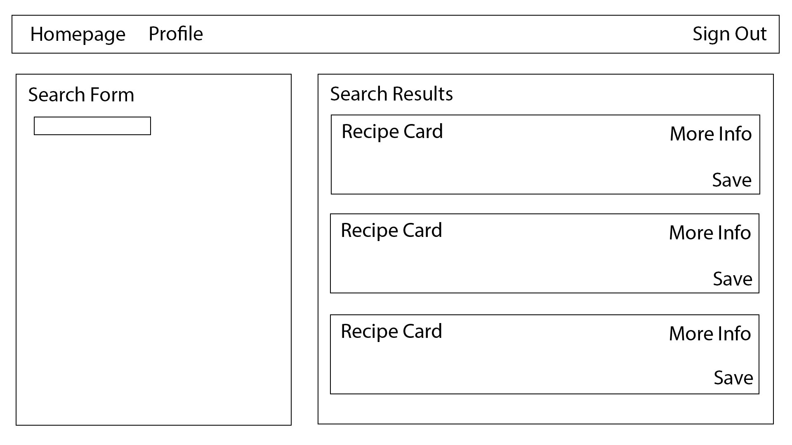
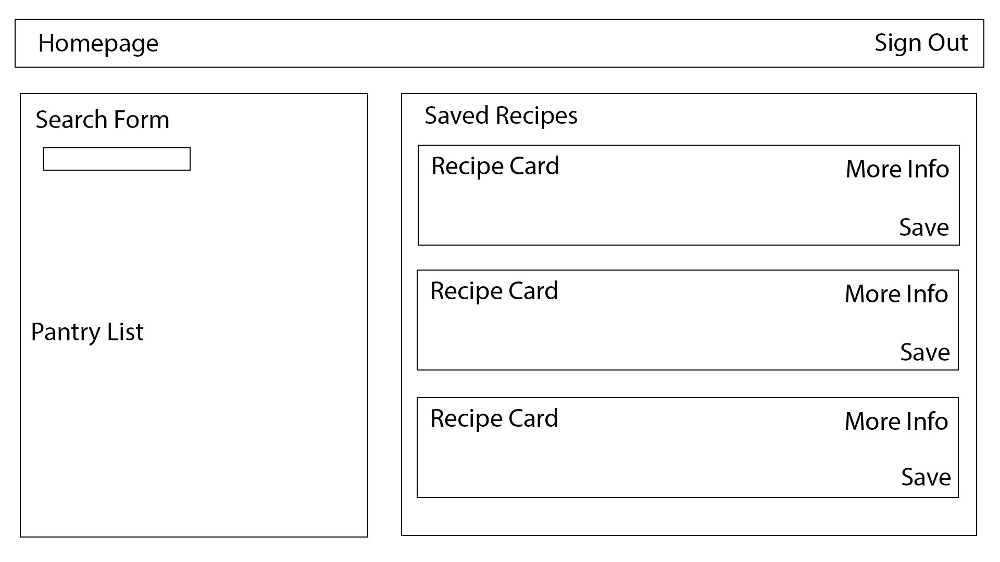
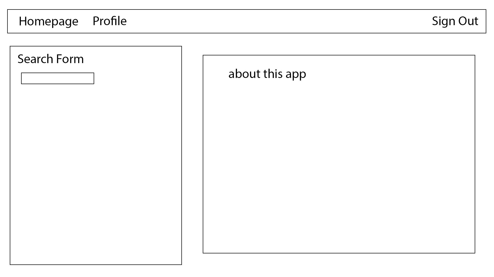

# **Kitchen Sink**
### **Description**
Kitchen Sink is an app designed to allow users to search for recipes using specific ingredients, based on dietary restrictions and other personal preferences. Users can save recipes they have tried and leave reviews with ratings and comments. Recpies that users have reviewed appear on the homepage for other users to peruse and try. Ideally, users would also be able to mark their favorites, save recipes for later, and store their pantry/grocery list in their profile, along with their own preferences. 
### MVP Goals
* Create a profile
* Search for recipes
* Save recipes with a review 
* View and/or add recipes other users have tried
* Add comments to reviews
### Stretch Goals
* Allow users to search based on dietary restrictions and other preferences
* Allow users to favorite and bookmark recipes 
* Allow users to limit search results based on the number of ingredients in the ingredient list, to target even more specific recipes
* Allow users to store their grocery/pantry list in their profile, with ability to add items to search query from this list
* Alert users when items in pantry list need to be used based on expiration/shelf life
* Users can auto-populate pantry list based on bar-codes and pictures of reciepts
### User Stories
* As a user, I want to be able to search for recipes that include specific ingredients and preferences
* As a user, I want to be able to create a profile 
* As a user, I want to save and review recipes that I have tried
* As a user, I want to be able to see recipes that other people have tried and comment on their reviews
### APIs
I plan to use the [Edamam Recipe API](https://developer.edamam.com/edamam-docs-recipe-api) for MVP and the [Shelf Life API](https://github.com/jcomo/shelf-life) for Stretch Goals. 
### Daily Sprints

Monday:
* test API
* write readme
* wireframe app
* plan database ERD
* plan routes

Tuesday:
* create db models -- test db
* stub routes -- test routes
* build routes

Wednesday:
* finish routes
* create views

Thursday:
* finish views
* mvp

Friday:
* debug refactor
* style views

Saturday:
* style views
* stretch goals

Sunday:
* stretch goals
### Wireframes
#### Homepage ( / )

#### Homepage with Search ( / )

#### Homepage with Search while signed in ( / )

#### User Sign up (/users/new)

#### User Login (/users/login)

#### Profile View (/users/:id)

#### Profile View (/users/:id)

#### Recipe Details View (/recipes/:id)

### Database ERDs

### RESTful routing chart 
Method | URL | Functionality | View 
 --- | --- | --- | ---
 GET | / | view home page | render index.ejs
 GET | /search  | search for recipes in API | render results to index.ejs
 GET | /search/:id | show recipe details | redirect to recipes detail view
 POST | /users/new | create a user | 
 GET | /users/login | 
 GET | /users/:id | show user profile |
 POST | /recipes | save a recipe | 
 GET | /recipes/:id | show recipe details | 
 POST | /review | add review | 
 PUT  | /review/:id | update review | 
 DELETE | /review/:id | delete review | 
 POST | /comment | add comment to review | 
 PUT  | /comment/:id | update comment | 
 DELETE | /comment/:id | delete comment | 
